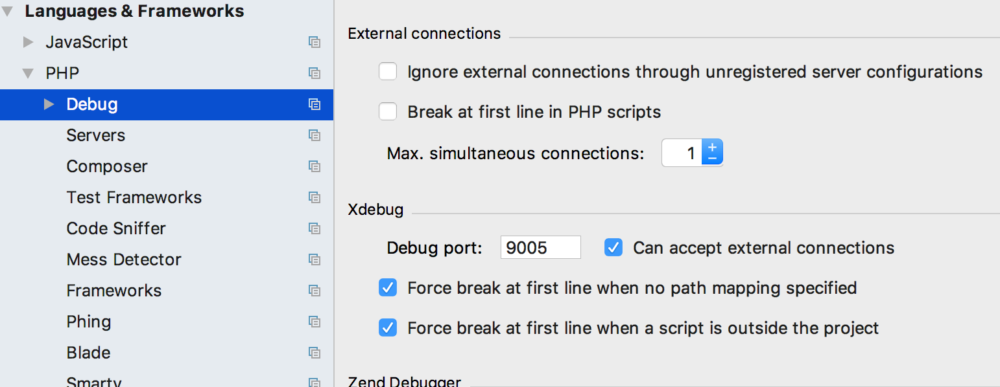
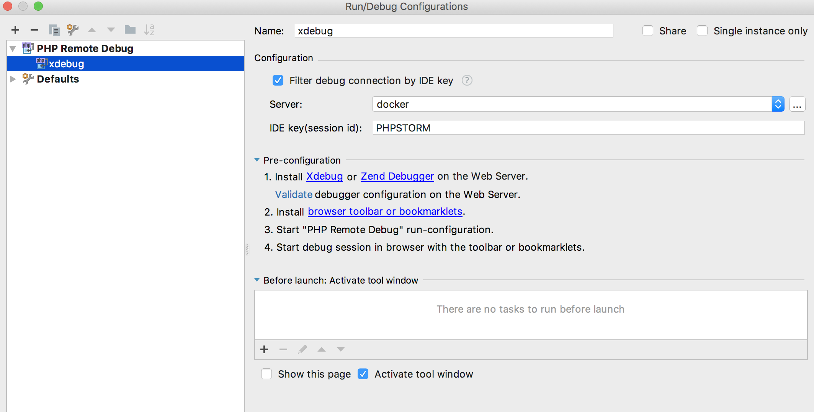
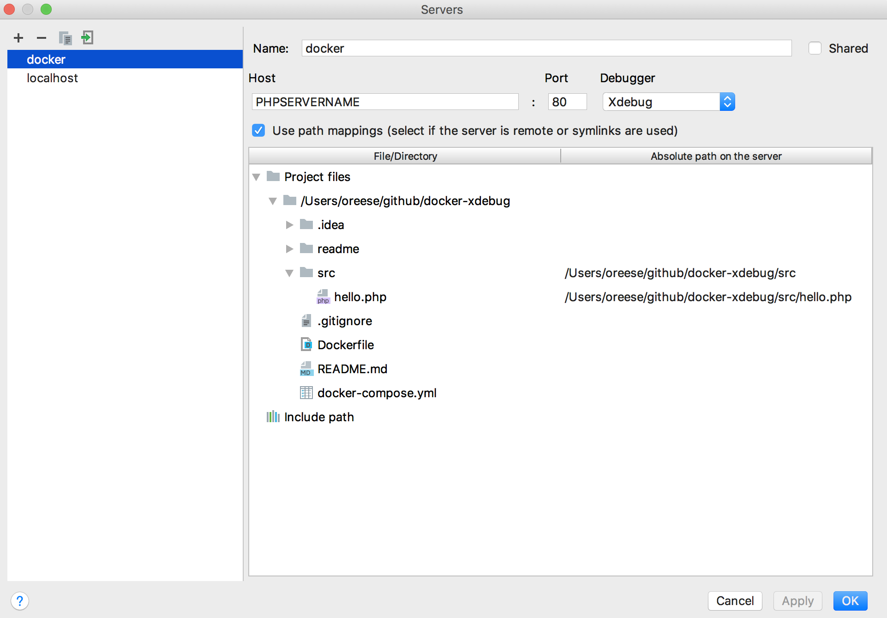
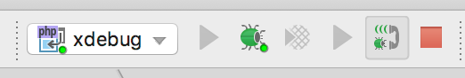
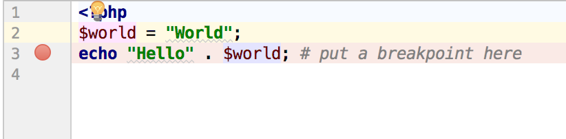

# docker-xdebug


Dockerfile

```
FROM php:7.0.19-apache

RUN apt-get update &&\
    apt-get install --no-install-recommends --assume-yes --quiet ca-certificates curl git &&\
    rm -rf /var/lib/apt/lists/*

RUN pecl install xdebug-2.5.5 && docker-php-ext-enable xdebug
RUN echo 'xdebug.remote_enable=1' >> /usr/local/etc/php/php.ini
RUN echo 'xdebug.remote_autostart=1' >> /usr/local/etc/php/php.ini
RUN echo 'xdebug.remote_connect_back=off' >> /usr/local/etc/php/php.ini
RUN echo 'xdebug.remote_host=host.docker.internal' >> /usr/local/etc/php/php.ini
RUN echo 'xdebug.remote_port=9005' >> /usr/local/etc/php/php.ini
RUN echo 'xdebug.idekey=PHPSTORM' >> /usr/local/etc/php/php.ini
```

docker-compose.yml

```
version: '3.7'
services:
  apache_with_php:
    build: .
    volumes:
      - ./src:/var/www/html/
    environment:
      PHP_IDE_CONFIG: serverName=PHPSERVERNAME
    ports:
      - "80:80"
```


Setting up PHPStorm

Settings: set Xdebug Port to 9005




Add Remote Debug in PhpStorm



Add Server 'PHPSERVERNAME' for remote debugging with path mapping



Click 'phone' to start listening for incoming xdebug sessions


Don't forget to set some breakpoints



todo:
update to php 7.4.x 
https://olvlvl.com/2019-06-install-php-ext-source
